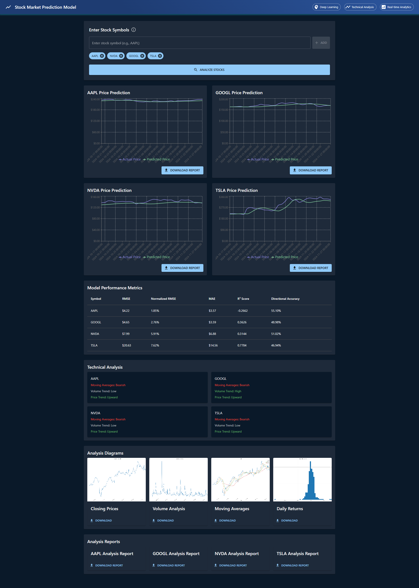

# Stock Market Prediction Model

An advanced stock market prediction system using LSTM neural networks for price forecasting and technical analysis.

## Features

- LSTM-based price prediction
- 5-year historical data analysis
- Technical indicators and trend analysis
- Interactive web interface
- Comprehensive performance metrics
- Detailed prediction reports
- Multi-stock analysis support

## Model Output


*Comprehensive stock analysis dashboard showing predictions and technical indicators for multiple stocks*

## Project Structure

```
├── data/
│   └── data_fetching.py          # Stock data retrieval
├── model_training/
│   └── model_training_and_prediction.py  # LSTM model implementation
├── results/
│   ├── {SYMBOL}_prediction_plot.png      # Generated prediction charts
│   └── {SYMBOL}_prediction_report.txt    # Detailed analysis reports
├── stock-prediction-frontend/    # Web interface
│   ├── api/                     # Flask backend
│   └── src/                     # React frontend
└── utils/
    ├── data_analysis_and_visualization.py
    └── risk_analysis.py
```

## Prerequisites

- Python 3.7 or higher
- Node.js 14 or higher
- pip (Python package manager)
- npm (Node.js package manager)

## Installation
1. Install Python dependencies:
```bash
pip install -r stock-prediction-frontend/api/requirements.txt
```

2. Install frontend dependencies:
```bash
cd stock-prediction-frontend
npm install
```

## Running the Application

1. Start the Flask backend:
```bash
cd stock-prediction-frontend/api
python app.py
```

2. Start the React frontend (in a new terminal):
```bash
cd stock-prediction-frontend
npm start
```

3. Open http://localhost:3003 in your browser

## Usage Guide

1. Enter Stock Symbols:
   - Type a stock symbol (e.g., "AAPL", "GOOGL")
   - Add multiple symbols using commas (e.g., "AAPL,MSFT,GOOGL")

2. View Results:
   - Interactive price prediction charts
   - Performance metrics:
     * RMSE (Root Mean Square Error)
     * MAE (Mean Absolute Error)
     * R² Score
     * Directional Accuracy
   - Technical analysis indicators:
     * Moving Averages trend
     * Volume trend
     * Price trend

## Model Architecture

- Input Layer: LSTM (128 units) with Dropout (0.2)
- Hidden Layer: LSTM (64 units) with Dropout (0.2)
- Dense Layer: 32 units with ReLU activation
- Output Layer: 1 unit (price prediction)

## Key Components

### Data Processing
- 5 years of historical data
- 80-20 train-test split
- 60-day sequence window
- MinMax scaling

### Model Training
- Adam optimizer
- Huber loss function
- Early stopping with patience=10
- Dropout layers for regularization

### Analysis Features
- Price trend prediction
- Moving averages analysis
- Volume trend analysis
- Comprehensive error metrics
- Technical indicator calculation

## Generated Reports

For each analyzed stock, the system generates:

1. Prediction Plot (results/{SYMBOL}_prediction_plot.png):
   - Actual vs Predicted prices
   - Clear trend visualization

2. Analysis Report (results/{SYMBOL}_prediction_report.txt):
   - Model architecture details
   - Performance metrics
   - Last 30 days predictions
